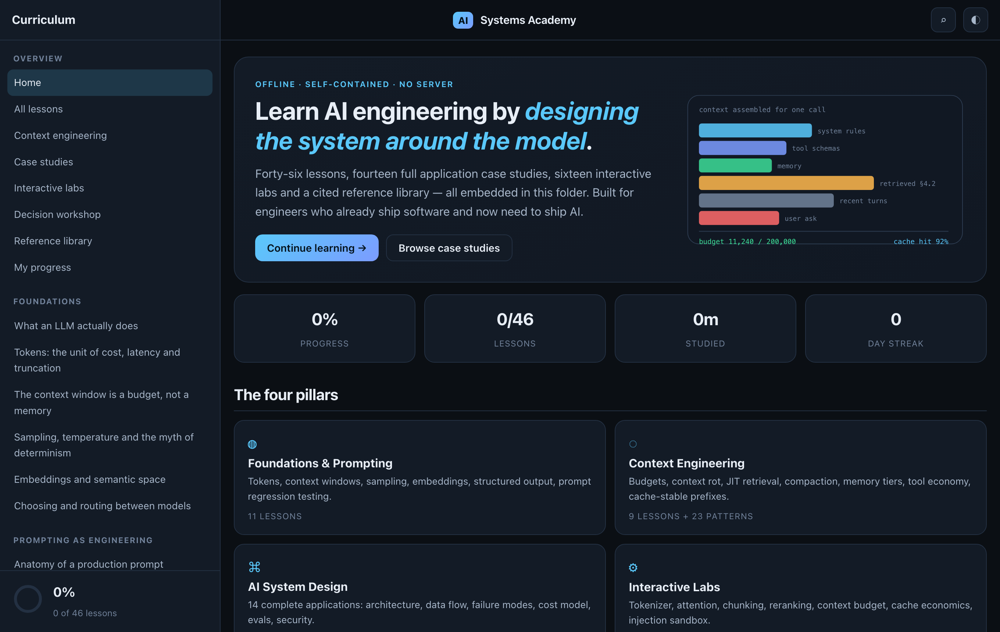
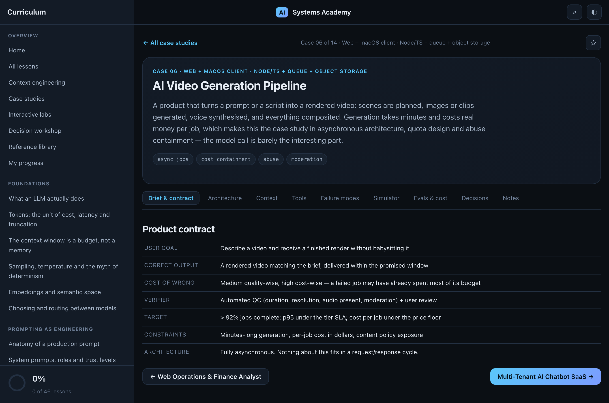
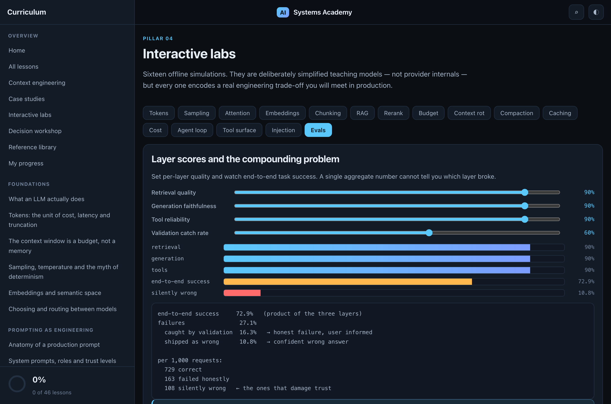
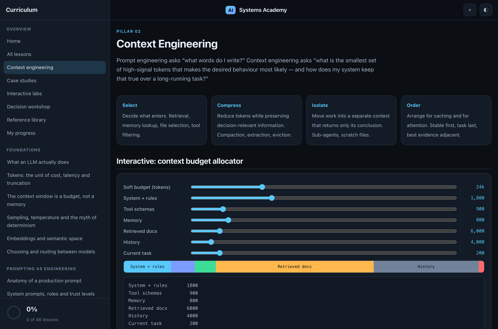
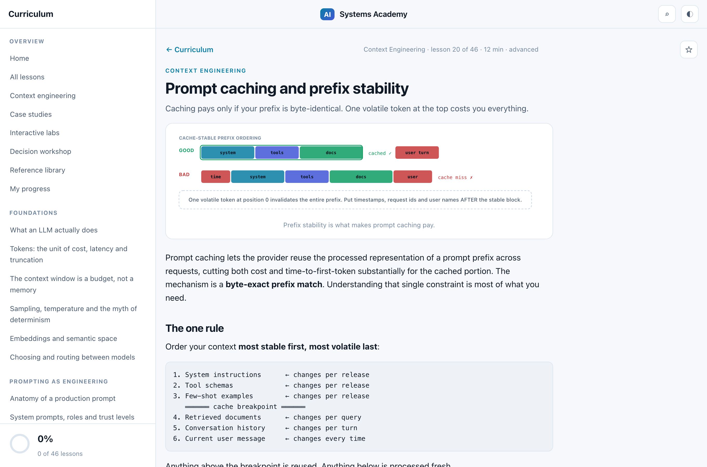

<div align="center">

# AI Systems Academy

### Learn AI engineering by designing the system *around* the model.

A free, offline course on **LLM application engineering, context engineering and production AI system design** — for engineers who already ship software and now need to ship AI.

**[▶ Open the course](https://harshadmehmood.github.io/ai-engineering-academy/)**

[](https://github.com/harshadmehmood/ai-engineering-academy/actions/workflows/verify.yml)
[](LICENSE)
[](#why-it-has-no-build-step)
[](CONTRIBUTING.md)

**46 lessons · 14 application case studies · 16 interactive labs · 104 graded questions · 0 dependencies**



</div>

---

## Why this exists

Most AI learning material teaches you to write a prompt. Almost none of it teaches you the part that actually decides whether your feature works in production: **what enters the context window, who holds authority over side effects, how you know when it is wrong, and what it costs at the 99th percentile.**

This course is the missing part. Every lesson is written for someone who can already build software and needs to know where the model fits inside it.

> An LLM is one stage in a pipeline you control. Everything else — memory, retrieval, tools, safety, cost — is software you write around it. Almost every failed AI feature fails at a boundary the team never drew.

## What's inside

<table>
<tr><td width="50%" valign="top">

### 📚 46 lessons · 7 modules
Roughly 9 hours of reading. Each lesson has a diagram, a worked example, named pitfalls, a graded self-check where the wrong answers are genuinely tempting, and a lab you can run against code you already own.

</td><td width="50%" valign="top">

### 🧩 14 application case studies
Not links to external reading — complete, self-contained design documents. Product contract, architecture, request trace, exact per-call context assembly, tool surface with authority levels, failure modes, cost model, eval scorecard.

</td></tr>
<tr><td width="50%" valign="top">

### 🔬 16 interactive labs
Offline simulations that make a trade-off *visible* instead of describing it: watch retrieval accuracy fall as you add distractors, watch a cache hit rate collapse when you put a timestamp in the wrong place.

</td><td width="50%" valign="top">

### 📖 Embedded reference library
A 23-pattern context-engineering catalog, 60 glossary terms, 10 cheat sheets, 14 formulas and 18 cited primary sources — all local, so the whole thing works on a plane.

</td></tr>
</table>

### The seven modules

| | Module | Covers |
|---|---|---|
| 1 | **Foundations** | What an LLM actually does · tokens · context windows · sampling · embeddings · model routing |
| 2 | **Prompting as Engineering** | Prompt anatomy · trust levels · structured output · few-shot · versioning and regression testing |
| 3 | **Context Engineering** | Budgets · context rot · JIT retrieval · compaction · memory tiers · tool economy · sub-agent isolation · cache-stable prefixes |
| 4 | **Retrieval & Knowledge** | RAG stages · chunking · hybrid search + RRF · reranking · agentic search · retrieval evaluation |
| 5 | **Tools & Agents** | Tool design · the agent loop · workflow vs agent · MCP · multi-agent · error recovery · human-in-the-loop |
| 6 | **Evaluation & Observability** | Why vibes fail · eval datasets · LLM-as-judge calibration · tracing · CI gating |
| 7 | **Production System Design** | A seven-layer design method · latency · cost · reliability · prompt injection · abuse · privacy · rollout |

### The 14 case studies

| # | Case study | Platform | The interesting constraint |
|---|---|---|---|
| 01 | macOS AI Developer Workspace | SwiftUI + AppKit | Picking 8k of a 900k-token repo |
| 02 | macOS PDF Intelligence & Editor | PDFKit | Every claim must highlight a real span |
| 03 | iOS AI Personal Assistant | on-device / cloud hybrid | Privacy as an architectural boundary |
| 04 | Web Customer Support Copilot | Node/TS + React | Every input is attacker-controlled |
| 05 | Web Operations & Finance Analyst | Postgres, text-to-SQL | A wrong number looks like a right one |
| 06 | AI Video Generation Pipeline | queue + object storage | Dollars per job, minutes per render |
| 07 | Multi-Tenant AI Chatbot SaaS | Node/TS + Firebase | Margin lives in the cache hit rate |
| 08 | CI Code Review Agent | GitHub Actions | Three false positives and you're muted |
| 09 | Enterprise Search & Knowledge | multi-source connectors | Permissions change faster than any index |
| 10 | Realtime Voice Support Agent | WebRTC + STT/TTS | 800 ms, and no undo on speech |
| 11 | Email Triage & Draft Agent | Gmail / Graph API | The send tool must not exist |
| 12 | Document Extraction Pipeline | batch + human review | Knowing which extractions to trust |
| 13 | Design-to-Code (Screenshot → SwiftUI) | multimodal | A compiler as a free verifier |
| 14 | Multi-Agent Research System | orchestrator + workers | When 60:1 compression justifies 10× cost |

Each opens with nine tabs: **Brief & contract · Architecture · Context · Tools · Failure modes · Simulator · Evals & cost · Decisions · Notes.**

<div align="center">


<br>


</div>

## Getting started

**Just use it:** [harshadmehmood.github.io/ai-engineering-academy](https://harshadmehmood.github.io/ai-engineering-academy/)

**Or run it locally** — clone and open the file. That is the entire setup.

```bash
git clone https://github.com/harshadmehmood/ai-engineering-academy.git
cd ai-engineering-academy
open index.html          # macOS · or xdg-open, or drag it into a browser
```

No server. No `npm install`. No build step. Works offline, on a plane, behind a firewall.

### Finding your way in

The home page offers six entry points **by problem** rather than by topic, because that is how people actually arrive:

- *I am new to LLM engineering*
- *My assistant degrades on long tasks*
- *My RAG answers are wrong*
- *I am building an agent*
- *It works but I cannot afford it*
- *I need to make it safe to ship*

| Shortcut | |
|---|---|
| <kbd>/</kbd> or <kbd>⌘K</kbd> | Search everything — lessons, cases, labs, patterns, glossary |
| <kbd>j</kbd> / <kbd>k</kbd> | Next / previous lesson |
| ◐ | Toggle light / dark — every diagram re-colours itself |

Progress, bookmarks and quiz history are stored in your browser's `localStorage`. **Nothing is uploaded anywhere.** Export/Import on the Progress page moves it between machines.

## Why it has no build step

The constraint is deliberate and it is load-bearing:

- **It still works in five years.** No dependency will rot, no framework will deprecate, no CDN will go down.
- **You can read all of it.** Every line of logic is in ten plain JavaScript files you can open and understand.
- **It works offline.** Genuinely — no network request is made at any point.
- **Nothing tracks you.** No analytics, no cookies, no signup, no account.

Node is used only for the dev scripts. The shipped site is HTML, CSS and ES5-compatible JavaScript.

```
index.html                 shell + page containers
styles.css                 design system, light + dark
js/
  diagrams.js              22 generated theme-aware SVG diagrams
  data-curriculum-{a,b,c}.js   46 lessons across 7 modules
  data-patterns.js         23 context-engineering patterns
  data-cases-{a,b}.js      14 application case studies
  data-reference.js        glossary, cheat sheets, formulas, sources, workshop
  labs.js                  16 interactive labs
  cases.js                 case renderer + 12 parametric simulators
  app.js                   router, markdown renderer, progress, page renderers
scripts/
  validate.js              content structure checks — runs in CI
  smoke.sh                 renders all 84 routes in headless Chrome — runs in CI
tools/
  start.sh                 companion offline course library — build, serve, open
  build-index.js           scans cloned course repos into an index
  library/                 the reader (html, css, js)
```

## Companion toolkit — offline course library

`tools/` holds a second, separate tool: a reader for course repositories you clone
yourself. The academy is the course I wrote; this reads everyone else's.

```bash
cd tools
git clone --depth 1 https://github.com/DataTalksClub/llm-zoomcamp.git
git clone --depth 1 https://github.com/huggingface/agents-course.git
git clone --depth 1 https://github.com/anthropics/courses.git anthropic-courses
./start.sh
```

With those three you get roughly **280 files, 170 written lessons, 81 notebooks and
350,000 words** in one searchable tree — written lessons rendered inline, notebooks
rendered with their stored outputs, and every notebook classified by *what it needs
beyond the files on disk* so you know before a flight which ones actually run.

It ships **no course content**. The generated index holds titles, paths and
structure only; the reader fetches each file from its own repo at view time, so the
courses keep their own licences and `git pull` keeps the library current.

Full setup and how to add a course: **[tools/README.md](tools/README.md)**.

## Quality checks

Both run on every pull request, and you can run them locally:

```bash
node scripts/validate.js   # 46 lessons, 14 cases, every diagram key, every quiz
./scripts/smoke.sh         # renders all 84 routes, fails on unrendered markup
```

`validate.js` catches the mistakes that are easy to make when adding content — a missing field, a diagram key that does not exist, a quiz with no correct answer, a simulator type that is not implemented. It has no dependencies and runs in under a second.

## Contributing

Contributions are genuinely welcome — see **[CONTRIBUTING.md](CONTRIBUTING.md)**.

The most valuable thing you can add is **a new case study**: a real application shape the existing 14 do not cover, with its own failure modes and cost model. Adding one is appending a single object to `js/data-cases-b.js` — navigation, search, filters and prev/next pick it up automatically. The schema and the twelve reusable simulator types are documented in the contributing guide.

Also very welcome: corrections with sources, new labs, and real production failure modes you have hit.

## Deliberate limitations

Stated plainly so nothing here misleads you:

- **No live AI.** Embedding an API key in a static site would expose it. Instead, every lesson has a *Copy tutor prompt* button that generates a context-rich prompt to paste into Claude or another assistant.
- **No cloud sync.** Progress lives in `localStorage`. Use Export/Import to move it.
- **The simulations are teaching models, not provider internals.** The tokenizer, attention map and sampling distributions are simplified illustrations. Each encodes a real engineering trade-off; none reflects any specific model's implementation.
- **Cost figures use illustrative placeholder rates.** They are labelled as such in the UI. Substitute your provider's current pricing before making a decision on them.

## Sources

All lesson prose is original. External material is cited rather than copied — the **Reference → Sources** tab lists 18 primary sources (Anthropic engineering posts and documentation, the Model Context Protocol specification, the OWASP LLM Top 10, Google and Hugging Face course material) with a note on which claims each one supports.

## Licence

[MIT](LICENSE) — use it, fork it, teach from it, ship it in your onboarding. Attribution appreciated, not required.

<div align="center">
<sub>If this is useful, a ⭐ helps other engineers find it.</sub>
</div>
